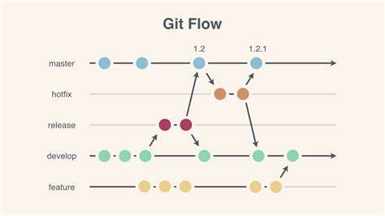

# Standards and Guidelines for Hit & GitHub

## Introduction

This document establishes the standards and best practices for using Git and GitHub within [Zeeck Digital Concept LTD](https://zeeckgroup.com/). Adhering to these guidelines are **MANDATORY** ensures consistency, collaboration, and version control across all projects.

## Repository Management

### Repository Ownership

- All repositories must be created under the company's GitHub account and not under personal accounts to maintain ownership and accessibility.

### Repository Naming Convention

- Repositories names should be very short and descriptive.

### Mandatory Repository Content

- All repositories must contain a `README.md` and `LICENSE` files. The content of these files should be gotten from the company's [Templates](../TEMPLATES/) contained in this GitHub repository. Developers should copy the templates and modify them as appropriate.
  - [README Template](../TEMPLATES/README.md)
  - [LICENSE Template](../TEMPLATES/LICENSE)

## Branching Strategy

### Branch Naming

- Branches should be created for every new feature, bug fix, or hotfix.
- Branches should fall under specific categories:
  - `main` or `master`: Main codebase branch. It stores the currently released version of code and should match the code that is in production.
  - `release#`: Release version branch (previous released version branch with the `#` symbol used for the version number).
  - `development` or `dev`: Development environment branch. It stores a copy of the `main` branch with all additional changes that have been added since the last release.
  - `feature`: Feature-specific branch. Developers branch off of `development` and create feature branches for any new features they are working on. There isn’t a single branch called feature unlike `main` and `development`. Branch names will generally be named based on the feature that is being added such `feat/UserSettingsEndpoint`.
  - `hotfix`: Hotfix-specific or Bugfix-specific branch. This category is used if there is an urgent production issue that requires a code fix then a `hotfix` branch is created. This is branched directly off of `main` and will usually be named after the incident `hotfix/InvalidPageMatch`.
- Naming conventions:
  - All branch names should be in lower-case letters. Example: `main`
  - Repositories under the `feature` and `hotfix` categories should have their names should start with the category as prefix followed by a forward slash and a descriptive branch name.Example:
    - `feature/setup`
    - `hotfix/user-email`, etc.
  - Repositories under the `main`, `development`, and `test` categories should have their branch names maintain the category name as only one of such branch is required for any repository
  - Repositories under the `release#` should have the prefix `release` followed by by the release version. Examples:
    - `release0.3.4`
    - `release1.0`

### Branch Creation & Merging

**Git FLow** is the standard flow of work used at Zeeck Digital Concept LTD. This standard is followed for creating projects and branches.

This is a general flow of how branches should be used in a project:

1. For new projects, a `main` branch is created first and left empty, maybe apart from a `README.md` and `LICENSE` files.
2. A `develop` branch is immediately branched off of `main`. No changes are ever made directly to `main` or `develop`.
3. Developers will branch off of `develop` into a feature branch to make their changes. Changes from `develop` will occasionally need to be merged into the `feature` branch depending on how long it takes to develop the feature.
4. Once a change is done a pull request (PR) is created so that the team can review the change before it is merged into `develop`. Any conflicting changes that have happened on `develop` will need to be resolved before the feature can be merged.
5. Once all the work for the release has been done a release branch is branched off of `develop`. Normally a QA team will run their tests on this release before it is ready for production. In the meantime, the developers can continue working on the `develop` branch on features for the next release.
6. If an issue is found with the release then a branch is usually created off of the release branch to work on the fix. This is then applied to the release branch once it has been reviewed.
7. When it comes to releasing, releases are usually either created from the release branch or from the `main` branch after the release is merged. If you release from `main` there is a risk that what you are releasing is different from what has been tested by QA. Although, this shouldn’t happen if you follow the process correctly. Either way, the release should be tagged with the release number so you know exactly what has been released and when.
8. After release, the `main` branch will be merged into `develop` so any changes made during testing are accounted for.
9. If there is a production issue after a release then a `hotfix` branch will usually be created off of the `main` branch in order to apply the fix.

Refer to the [Git Flow vs GitHub Flow](https://www.alexhyett.com/git-flow-github-flow/) article or watch the [Git Flow vs GitHub Flow: What You Need to Know](https://www.youtube.com/watch?v=hG_P6IRAjNQ&ab_channel=AlexHyett) for more information.

## Committing Changes

### Commit Message Convention

- All commits should start with a **commit keyword** followed by the commit message. Standard keywords used at Zeeck Digital Concept LTD are `docs`, `feat`, `chore`, `fix`, `test`, and `BREAKING!`. The following are various keywords that are used at Zeeck Digital Concept LTD:
  - `[docs:]` - The `docs` keyword is used for the commit that updates documentation, change texts in UI or adds comments to codebase.
    - `docs: add documentation for user endpoint`
    - `docs: correct typo on contact page`
  - `[feat:]` - The `feat` keyword is used for commits that introduce new features to the codebase. Example:
    - `feat: allow provided config object to extend other configs`
    - `feat: setup application template`
  - `[chore:]` - The `chore` keyword is used for commits that introduce new features to the codebase but are not are not important enough to use `feat`.
    - `chore: improve product responsiveness`
    - `chore: update profile user interface`
  - `[fix:]` - The `fix` keyword is used for commits that patches a bug in the codebase. Example:
    - `fix: prevent sending of requests`
    - `fix: product item page not visible`
  - `[BREAKING!]` - The `BREAKING!` keyword is used for commits that introduce breaking features (correlating with **MAJOR** in Semantic Versioning). A `BREAKING CHANGE` can be part of any other keyword commit and can be signified using the `!` mark. Example of:
    - `BREAKING! use JavaScript features not available in Node 6.`
    - `chore!: drop support for Node 6`
    - `feat!: send an email to the customer when a product is shipped`
  - `[test:]` - The `test` keyword is used for commits that are add or modify application test files. Examples:
    - `test: add unit test for store module`
    - `test: improve test for util function`
- Commits should always use the appropriate above keywords. This will maintain consistency across applications and improve code quality. We recommend reading [Conventional Commits](https://www.conventionalcommits.org/en/v1.0.0/#summary) for more information about commit keywords.

## Issue Tracking and Management

### Issue Creation

When creating issues within the project repository, it's crucial to follow a standardized format for efficient issue tracking and resolution. Adhering to the company's issue template ensures consistency across all issues logged within the project.

Guidelines for Issue Creation:

- **Use Company's Issue Template**: Use the predefined [Issue Template](../TEMPLATES/ISSUE.md) provided by the company in [Templates](../TEMPLATES/) of this repository. This template includes fields for a detailed problem description, steps to reproduce, expected behavior, and any additional context necessary for understanding and resolving the issue effectively.

- **Include Relevant Details**: Provide comprehensive information about the problem encountered. Describe the issue in detail, including its context, expected outcomes, and any related errors or unexpected behaviors observed.

- **Steps to Reproduce**: Include clear, step-by-step instructions to reproduce the issue. This helps in understanding and verifying the problem, allowing others to replicate the issue easily.

- **Expected Behavior**: Clearly state what behavior or result was anticipated. This helps in comparing the expected outcome with the actual behavior encountered.

### Pull Requests

Pull requests (PRs) represent proposed changes to the codebase and should also follow a standardized format to ensure clarity and consistency in the review process. PR must be raised before a code is merged to any branch in the codebase of the company.

Guidelines for Pull Requests:

- **Use Company's Pull Request Template**: Use the provided [Pull Request Template](../TEMPLATES/PULL_REQUEST.md) provided by the company in [Templates](../TEMPLATES/)to outline the details of the changes made, reasons for the changes, and any additional information needed for reviewers to understand the context of the PR.

- **Association with Issues**: Each pull request should be associated with an issue. This ensures that every code change is linked to a specific problem or enhancement request, enabling easier tracking and cross-referencing between issues and PRs.

- **Detailed Description**: Provide a comprehensive description of the changes introduced in the PR. Explain the purpose of the changes, their impact on the codebase, and any potential side effects.

## Code Review and Merge Process

Code review is a crucial step in ensuring code quality, adherence to standards, and the identification of potential issues before merging changes into the codebase. It is essential to follow a structured process for code review and merging to maintain a high-quality codebase.

Guidelines for Code Review and Merge Process:

- **Code Review Required**: All code changes, regardless of their size or complexity, **must undergo a code review process before being merged into subsequent branches**. This ensures that the changes are reviewed by peers or team members, enhancing code quality and reducing the possibility of introducing bugs.

- **Approval for Merge**: Only reviewed and approved code should be merged into subsequent branches. This helps in maintaining the stability of the codebase and ensures that the changes align with the project's standards and requirements.

- **Documentation and Comments**: Maintain clear and comprehensive documentation within the codebase. Include meaningful comments, relevant explanations, and detailed documentation where necessary to facilitate easier code review. Well-documented code aids reviewers in understanding the changes and their purpose, contributing to effective reviews.

Code Review Checklist:

- [x] **Functionality**: Check if the code changes meet the specified requirements and functionality.
      Coding Standards: Ensure that the code follows the company's coding standards and best practices.

- [x] **Error Handling**: Verify that error handling mechanisms are in place and appropriate for potential edge cases.

- [x] **Unit Tests**: Validate that new code is accompanied by appropriate unit tests or that existing tests are updated to accommodate changes.

- [x] **Documentation**: Review if code changes include necessary updates to documentation or inline comments.

Following these guidelines ensures that every code change undergoes a thorough review process, leading to a higher-quality codebase and smoother integration of changes into subsequent branches. Adjust and refine the code review process as needed based on the project's requirements and team dynamics.

## Conclusion

Adhering to these standards will facilitate better collaboration, version control, and code quality across projects within [Company Name]. These guidelines ensure consistency and best practices, fostering efficient development and deployment processes.

Please follow these guidelines and encourage fellow team members to contribute to their improvement for the benefit of the entire team.

Happy Codding 😎!

## Other Guidelines & Standards

ALso check out the following guidelines & standards used in Zeeck Digital Concept LTD:

- [Git \& GitHub Guidelines](../GUIDELINES/GIT_SPEC.md)
- [Document Templates ](../TEMPLATES/)
  - [README Template](../TEMPLATES/README.md)
  - [LICENSE Template](../TEMPLATES/LICENSE)
  - [Pull Request Template](../TEMPLATES/PULL_REQUEST.md)
  - [Issue Request Template](../TEMPLATES/ISSUE.md)
- [JavaScript - Framework Standards \& Guidelines ](../STANDARDS/JS/JS_SPEC.md)
- [Golang Standards \& Guidelines ](../STANDARDS/GO/GO_SPEC.md)
- [LARAVEL Standards \& Guidelines ](../STANDARDS/LARAVEL/LARAVEL_SPEC.md)
- [API Documentation Standards ](../GUIDELINES/API_SPEC.md)

**| @ Zeeck Digital Concept LTD |**
